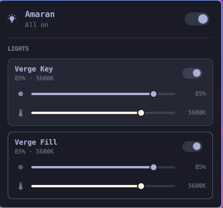

# Amaran Lights for Omarchy

An Elgato Control Center style bar widget for [Omarchy](https://omarchy.org):
power, brightness, and colour temperature for your amaran / Aputure lights,
one click from the top of the screen.



- **Master switch** turns the whole rig on or off from the panel hero.
- **Per-fixture cards** with a power switch, a brightness slider, and a colour
  temperature slider that tints itself with the colour it is dialling in.
- **Right-click the bar icon** to kill every light without opening anything.
- **Keyboard navigable** like every first-party panel, and scriptable over IPC
  so the lights can go on a Hyprland keybind.

## How it works

amaran fixtures have no Wi-Fi and no network API. They speak a proprietary
Telink Bluetooth Mesh dialect, so something has to hold a BLE connection and
translate. This widget does not do that itself — it drives the REST API of
[wesbos/amaran-BLE-control](https://github.com/wesbos/amaran-BLE-control),
which is the project that reverse-engineered the mesh protocol.

```
Omarchy bar widget  ──HTTP──▶  amaran BLE daemon  ──BLE Mesh──▶  your lights
   (this repo)                (wesbos/amaran-BLE-control)
```

Because the hop is plain HTTP, the daemon does not have to live on the same
machine. Point the widget at whatever is holding the Bluetooth connection: this
PC, a Mac on the desk, or an always-on ESP32 bridge.

## Requirements

1. **A Bluetooth radio** on whichever machine runs the daemon. Check with
   `bluetoothctl list` — no output means no adapter, and no adapter means no
   lights. (An ESP32 bridge brings its own radio; see below.)
2. **Your mesh keys.** Joining the mesh needs its network key and application
   key. The only practical source is the amaran Desktop app's database, so you
   need a Mac or Windows machine that has amaran Desktop paired with your
   lights — once, to export them.
3. **Node.js 20+** wherever the daemon runs.

## Setup

The one-time work is getting your mesh keys out of the amaran app. **[SETUP.md](SETUP.md)
walks through it**, including what to do when one of the assumptions above does
not hold.

The short version:

### 1. Install the widget

```bash
omarchy plugin add https://github.com/ttiimmaahh/omarchy-amaran.git --enable
```

It appears in the bar right away and says it cannot reach a daemon — that is
expected until step 3.

### 2. Export your keys (on the Mac or Windows box)

Copy `tools/amaran-export-keys.sh` to the machine running amaran Desktop and
run it:

```bash
./amaran-export-keys.sh lights.json
scp lights.json you@linux-box:~/
```

> **That file is a credential.** It holds the keys to your mesh. It is written
> `0600`; move it with `scp` and never commit it.

### 3. Run the setup wizard (on the machine with the Bluetooth radio)

Click **Set up lights…** in the panel, or run it directly:

```bash
./tools/amaran-setup
```

It clones and installs the [amaran BLE
daemon](https://github.com/wesbos/amaran-BLE-control) if needed, takes your keys
— imported from step 2, or typed in by hand with hidden input — writes its
`lights.json` at `0600`, checks the Bluetooth adapter and `CAP_NET_RAW`, and
tells you how to start it.

The widget picks the lights up on its next poll.

### Running the daemon on another machine

The hop is plain HTTP, so the daemon can live anywhere: a Mac, a spare box, an
ESP32 bridge. Set **host** in the widget settings, and have the daemon listen
beyond loopback (`"http": { "host": "0.0.0.0", "apiKey": "…" }` in its
`lights.json`) — set an `apiKey`, because that API is otherwise unauthenticated.

To keep a local daemon running across logins, let the wizard install the
systemd user service — it offers to at the end, and generates the unit with
your real paths. That matters: a systemd user unit does not inherit your
shell's `PATH`, so a version-managed Node (mise, nvm, asdf, fnm) is invisible
to it, and a hand-copied unit with `ExecStart=/usr/bin/npx` will not start.

`tools/amaran-daemon.service` is a fallback template if you would rather do it
by hand; edit **both** `WorkingDirectory` and `ExecStart` before enabling it.

## Settings

Set these on the widget's entry in `~/.config/omarchy/shell.json`; the shell
hot-reloads on save.

| Setting | Default | What it does |
|---|---|---|
| `host` | `127.0.0.1` | Machine running the amaran daemon |
| `port` | `2708` | Daemon port |
| `apiKey` | `""` | Sent as `Authorization: Bearer …`; must match the daemon |
| `daemonDir` | `~/amaran-BLE-control` | Where the daemon and its `lights.json` live; used by the setup button |
| `refreshIntervalSec` | `15` | How often the fixture roster is re-fetched |
| `minKelvin` | `2700` | Warm end of the temperature slider |
| `maxKelvin` | `6500` | Cool end of the temperature slider |
| `hideWhenUnreachable` | `false` | Drop the icon from the bar when the daemon is down |

The defaults match the **amaran Verge** (2700–6500K bi-colour). Older amaran
fixtures reach 2500–7500K — widen the range if yours do.

## Keybindings

Every control is reachable over IPC, so it can go on a Hyprland bind in
`~/.config/hypr/bindings.lua`:

```lua
o.bind("SUPER", "L", "exec", "omarchy-shell amaran toggleAll")
o.bind("SUPER SHIFT", "L", "exec", "omarchy-shell amaran allOff")
o.bind("SUPER", "K", "exec", "omarchy-shell amaran setBrightness 100")
```

| Command | Effect |
|---|---|
| `omarchy-shell amaran toggle` | Open/close the panel |
| `omarchy-shell amaran allOn` / `allOff` / `toggleAll` | Power, every fixture |
| `omarchy-shell amaran setBrightness <0-100>` | Brightness, every fixture |
| `omarchy-shell amaran setTemperature <kelvin>` | Colour temperature, every fixture |
| `omarchy-shell amaran refresh` | Re-fetch the roster |

Inside the panel: arrows move and adjust, Enter toggles, `a` all on, `o` all
off, `r` refresh, Escape closes.

## Development

There is a stand-in daemon so you can work on the widget with no radio and no
lights in the room:

```bash
node tools/mock-daemon.mjs          # serves the real API on :2708, logs commands
node tools/mock-daemon.mjs --with-state   # also reports fixture state
```

Then validate and lint before submitting:

```bash
omarchy plugin validate .
qmllint -I "$OMARCHY_PATH/shell" Panel.qml Service.qml
```

> `qmllint` exits 255 on any file containing an `IpcHandler`, including
> first-party ones like `Ui/Panel.qml`. That is a linter crash, not a defect —
> lint a copy with the handler removed if you want a clean signal.

## Troubleshooting

**The panel says it needs mesh keys** — that is the normal first-run state.
Click **Set up lights…**, or read [SETUP.md](SETUP.md).

**"Cannot reach the daemon"** — the daemon is not running or not listening
where the widget is looking. `curl http://<host>:2708/` from this machine.

**`Failed to enable unit: Unit amaran-daemon.service does not exist`** — the
unit was never installed. Re-run `tools/amaran-setup` and accept the systemd
step, or copy the template in by hand as described above.

**The service is enabled but dies immediately** — almost always `ExecStart`
pointing at a Node that is not there. Check with
`systemctl --user status amaran-daemon`, and compare its `ExecStart` against
`readlink -f "$(command -v node)"`. Re-running the wizard rewrites it.

**"Daemon rejected the API key"** — `apiKey` here does not match `http.apiKey`
in the daemon's `lights.json`.

**The panel is empty and says the daemon has no lights** — the daemon is up but
its `lights.json` has no fixtures. Re-run the export script.

**Commands are accepted but nothing moves** — the daemon is reaching the mesh
but not your fixtures. Close amaran Desktop and the phone app first: a fixture
serving another proxy client will not accept a second one.

**State looks wrong after a restart** — the daemon reports a roster, not live
dimmer state, so this widget remembers what it last sent, in
`~/.local/state/omarchy-amaran/state.json`. If you also drive the lights from
the phone app, the widget will not know. Delete that file to reset.

## Notes and limits

- **Bi-colour only.** The daemon also speaks HSI, and RGB amaran fixtures
  support it, but the Verge is bi-colour so there is no hue control here yet.
- **State is optimistic.** `GET /` returns only the static roster. If the
  daemon ever reports live state, this widget already honours it — see
  `Model.adoptState`.
- **A mesh command costs roughly half a second.** Slider drags are coalesced
  and rate-limited to about five commands a second, and the value you stop on
  is always the one that lands.

## Credits

The hard part — the Telink mesh crypto, the proxy protocol, and opcode `0x26`
— is [wesbos/amaran-BLE-control](https://github.com/wesbos/amaran-BLE-control)
(MIT). This repo is the Omarchy front end for it.

MIT licensed. Not affiliated with amaran, Aputure, or Omarchy.
